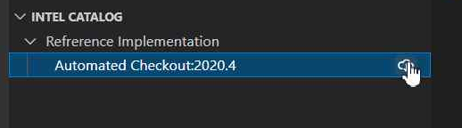
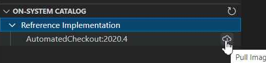
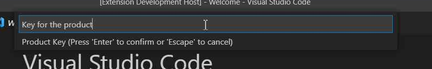

# Extension to install and run Reference Implementations

## Prerequisites
* [Docker](https://www.docker.com/) is installed.
* For Linux user, make sure you could manage Docker as a [non-root user](https://docs.docker.com/engine/install/linux-postinstall/) without sudo.
* For [proxied network](https://docs.docker.com/config/daemon/systemd/#httphttps-proxy) , make sure you can work with docker by making few changes.
  
## Usage
* Click on pull from the Intel Catalog section, to copy it to your own system.  
  
#
* Click on the particular RI from On System Catalog to get it installed 
 
#
* Enter the product key as sent to you in your mail while you register for the RI on ESH website 
 
#
* Image Pulled Successfully 
 
